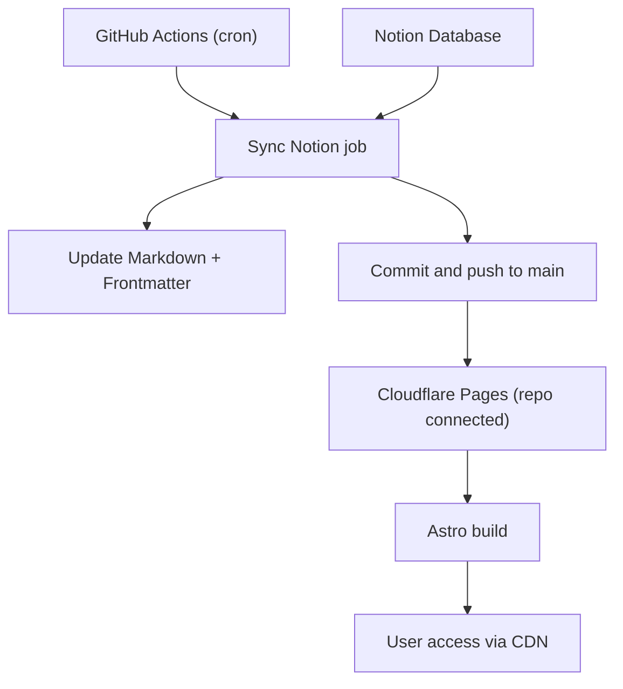

# hamakyo.log

**個人ブログ** - Astro で構築されたブログ

技術や日々の学びを記録する場所として運営しています。

## 機能

このブログは以下の機能を備えています：

- Astro v4 による高速パフォーマンス
- TailwindCSS によるスタイリング
- レスポンシブデザイン・SEO 最適化
- ダーク・ライトモード切り替え
- Markdown および MDX サポート
- 自動 RSS・サイトマップ生成
- ページネーション機能

## 開発コマンド

| コマンド             | 説明                                  |
| :------------------- | :------------------------------------ |
| `pnpm install`       | 依存関係をインストール                |
| `pnpm run dev`       | 開発サーバーを起動 (`localhost:4321`) |
| `pnpm run build`     | 本番用ビルドを作成                    |
| `pnpm run preview`   | ビルドをローカルでプレビュー          |
| `pnpm run sync-notion` | NotionからMarkdownファイルを同期      |

## 設定

### サイト設定・ソーシャルリンク・ナビゲーション

`src/consts.ts`でサイトのタイトル、説明、言語、プロフィール、ソーシャルメディアリンク、ナビゲーションリンクを設定できます。

### 記事の追加

`src/content/blog/`に Markdown または MDX ファイルを追加してください。

### Notionからの記事同期

NotionデータベースからMarkdownファイルを自動生成してブログに同期できます。

#### 初期設定
1. `.env.example`を`.env.local`にコピー
2. Notion Integration Token と Database ID を設定
3. `pnpm run sync-notion`を実行

```bash
# 環境変数設定
cp .env.example .env.local
# .env.local を編集してNotion設定を追加

# 同期実行
pnpm run sync-notion
```

#### 必要な環境変数
- `NOTION_TOKEN`: Notion Integration Token
- `NOTION_DATABASE_ID`: 同期対象のNotionデータベースID

#### Notionデータベースの要件
記事として認識されるには、以下のプロパティが必要です：
- **Status** (Status): "Published"に設定された記事のみ同期
- **Title/Name** (Title): 記事タイトル
- **Description** (Text): 記事の説明（オプション）
- **PublishDate/Date** (Date): 公開日（オプション）
- **Tags** (Multi-select): タグ（オプション）
- **Series** (Select): シリーズ名（オプション）

## 技術構成

- **フレームワーク**: Astro v4
- **スタイリング**: Tailwind CSS
- **アイコン**: Astro Icon
- **デプロイ**: Cloudflare Pages

## 構成図



## ライセンス

このプロジェクトは [Astro Theme Cody](https://github.com/kirontoo/astro-theme-cody) をベースにしています。
