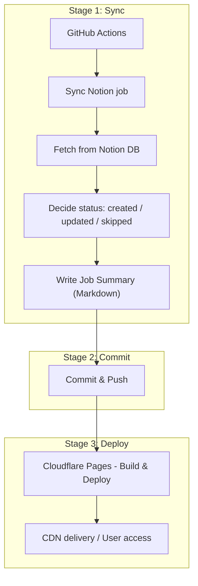

# hamakyo.log

**個人ブログ** - Astro で構築されたブログ

技術や日々の学びを記録する場所として運営しています。

## 機能

このブログは以下の機能を備えています：

- Astro v7 による高速パフォーマンス
- TailwindCSS によるスタイリング
- レスポンシブデザイン・SEO 最適化
- ダーク・ライトモード切り替え
- Markdown および MDX サポート
- 自動 RSS・サイトマップ生成
- ページネーション機能

## 必要な環境

- Node.js 22.12.0 以上
- pnpm 11.8.0

このリポジトリは `packageManager` で pnpm のバージョンを固定しています。Corepack を有効にしておくと、`pnpm install` 実行時に指定バージョンが自動で使われます。

```bash
corepack enable
pnpm install
```

## 開発コマンド

| コマンド             | 説明                                  |
| :------------------- | :------------------------------------ |
| `pnpm install`       | 依存関係をインストール                |
| `pnpm run dev`       | 開発サーバーを起動 (`localhost:4321`) |
| `pnpm run build`     | 本番用ビルドを作成                    |
| `pnpm run preview`   | ビルドをローカルでプレビュー          |
| `pnpm test`          | 同期処理の単体・結合テスト             |
| `pnpm test:e2e`      | Chromiumで主要画面のE2Eテスト          |
| `pnpm run sync-notion` | NotionからMarkdownファイルを同期      |

## 設定

### サイト設定・ソーシャルリンク・ナビゲーション

`src/consts.ts`でサイトのタイトル、説明、言語、プロフィール、ソーシャルメディアリンク、ナビゲーションリンクを設定できます。

### 記事の追加

`src/content/blog/`に Markdown または MDX ファイルを追加してください。

コンテンツコレクションのスキーマは `src/content.config.ts` で管理しています。Astro v7 の Content Layer API を使っているため、旧来の `src/content/config.ts` は使用しません。

### Notionからの記事同期

NotionデータベースからMarkdownファイルを自動生成してブログに同期できます。

#### 初期設定
1. `.env.example`を`.env.local`にコピー
2. Notion Integration Token、Memos Database ID、Gemini API Keyを設定
3. `pnpm run sync-notion`を実行

```bash
# 環境変数設定
cp .env.example .env.local
# .env.local を編集してNotion設定を追加

# 同期実行
pnpm run sync-notion
```

#### 必要な環境変数
- `NOTION_TOKEN`: Notion Integration Token
- `NOTION_DATABASE_ID`: MemosデータベースID
- `GEMINI_API_KEY`: Google AI Studioで作成したAPIキー

#### Notionデータベースの要件
現在の `All` 配下の構成をそのまま利用します。

- **Memos / Name** (Title): 記事タイトル
- **Memos / Tags** (Relation): `Study.Log`を付けた記事だけ同期。`INBOX`は付けたままで構いません
- **Tags / ブログ表示** (Checkbox): Geminiが公開タグとして選択してよいタグだけ有効化
- **Tags / タグの説明** (Text): タグ選択の補足説明（任意）

備考: 記事の説明プロパティは不要です。説明が未設定でもビルド・表示に影響はありません。

新規記事の初回同期時だけGemini 3.1 Flash-Liteが本文を読み、英語slugと0〜4個の公開タグを生成します。結果はMarkdownのfrontmatterへ保存され、以後の同期では再生成しません。APIキー未設定・タイムアウト・応答検証失敗時は、決定的なローカルslugと空の公開タグで同期を継続します。

同期したMarkdownには `notionId` と固定`slug`が保存されます。初回移行時は既存記事をタイトルで照合し、以後は`notionId`で追跡するため、Notion上で記事タイトルを変更しても別ファイルは作られません。`Study.Log`と`INBOX`は内部タグとしてGeminiの公開タグ候補から常に除外されます。新規タグ候補はGitHub Actionsの同期サマリーへ出力するだけで、Notionへ自動作成はしません。

## 技術構成

- **フレームワーク**: Astro v7
- **スタイリング**: Tailwind CSS
- **アイコン**: Astro Icon + Iconify JSON packages
- **パッケージマネージャー**: pnpm 11
- **デプロイ**: Cloudflare Pages

### pnpm build scripts

Cloudflare Pages では pnpm 11 の build-script 承認が有効です。`pnpm-workspace.yaml` の `allowBuilds` で、ビルドに必要な `esbuild` と `sharp` の install script を許可しています。

## 構成図


```mermaid
flowchart TD
  subgraph Stage1["Stage 1: Sync"]
    A["GitHub Actions"] --> B["Sync Notion job"]
    B --> C["Fetch from Notion DB"]
    C --> D["Decide status: created / updated / skipped"]
    D --> E["Write Job Summary (Markdown)"]
  end

  subgraph Stage2["Stage 2: Commit"]
    E --> F["Commit & Push"]
  end

  subgraph Stage3["Stage 3: Deploy"]
    F --> G["Cloudflare Pages - Build & Deploy"]
    G --> H["CDN delivery / User access"]
  end
```

## ライセンス

このプロジェクトは [Astro Theme Cody](https://github.com/kirontoo/astro-theme-cody) をベースにしています。
